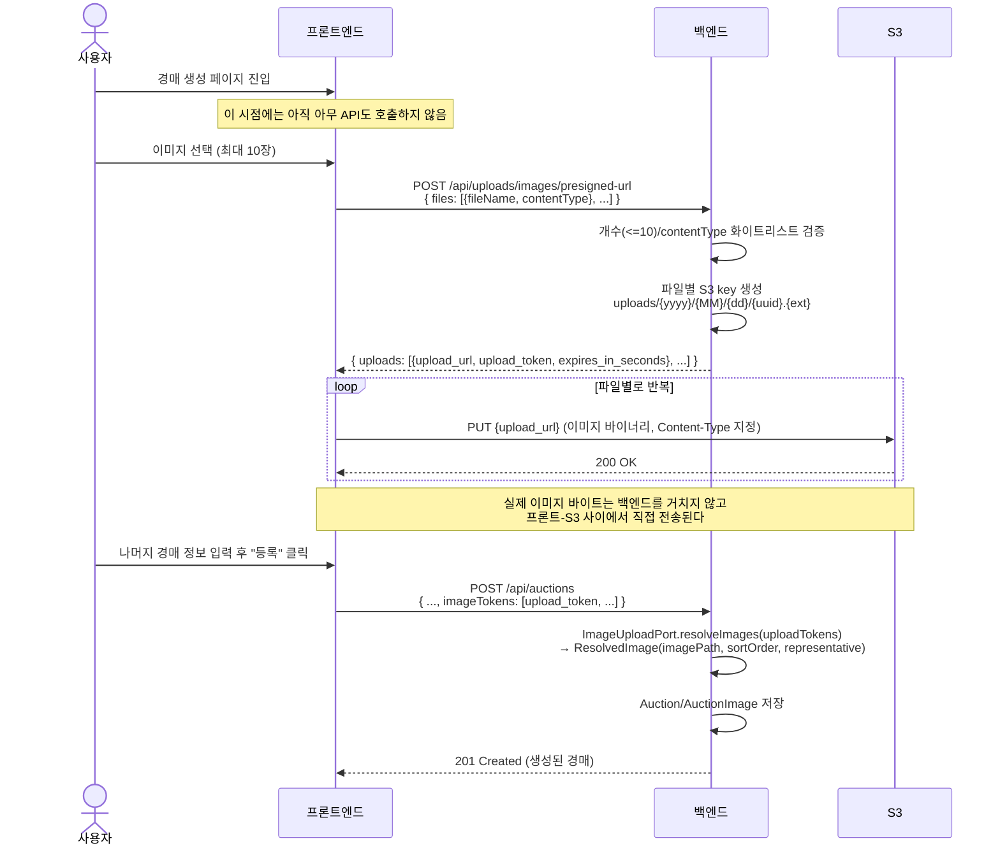

# 이미지 업로드 흐름 (경매 등록)

경매 생성 페이지에서 사용자가 이미지를 등록하고 경매를 최종 생성하기까지, 프론트엔드·백엔드·S3 사이의 API 흐름을 정리한다.

관련 이슈: [#36](https://github.com/softeerbootcamp-8th/WEB-TEAM2-2gether/issues/36)

## 전체 흐름 요약

1. 사용자가 경매 생성 페이지에 진입한다. (아직 presigned URL을 요청하지 않는다)
2. 사용자가 이미지를 선택한다. (파일 input / 드래그드롭, 최대 10장)
3. 프론트엔드가 선택된 파일들의 `fileName`/`contentType`을 모아 백엔드에 presigned URL 발급을 요청한다.
4. 백엔드가 파일별로 S3 key를 생성하고, 그 key에 대한 presigned PUT URL을 발급해 응답한다.
5. 프론트엔드가 각 presigned URL로 이미지를 S3에 직접 PUT 업로드한다. (백엔드를 거치지 않는다)
6. 사용자가 나머지 경매 정보(제목, 시작가 등)를 입력하고 "등록"을 누르면, 프론트엔드는 업로드가 끝난 이미지들의 `upload_token` 목록과 함께 경매 생성 API를 호출한다.
7. 백엔드는 `ImageUploadPort.resolveImages(uploadTokens)`로 각 토큰을 `imagePath`로 변환해 `Auction`/`AuctionImage`를 저장한다.

## 시퀀스 다이어그램



## 단계별 상세

### 1. 페이지 진입 시점에는 아무것도 하지 않는다

presigned URL은 유효기간이 짧고(수 분), `contentType`처럼 실제 파일의 메타데이터에 의존하기 때문에 페이지 진입과 동시에 미리 여러 장을 발급해두지 않는다. 사용자가 실제로 파일을 고른 시점에만 그 파일들에 맞는 URL을 요청한다.

### 2. presigned URL 발급 — `POST /api/uploads/images/presigned-url`

- 요청은 배열 기반 배치 호출이다. 사용자가 한 번에 여러 장을 선택해도 API 호출은 1회다.
- 요청 개수가 0개거나 10개를 초과하면 400.
- `contentType`이 허용 목록(`image/jpeg`, `image/png`, `image/webp`) 밖이면 400.
- S3 key(=`upload_token`)는 서버가 생성한다. 클라이언트가 보낸 `fileName`은 확장자 추출 참고용일 뿐, key 자체는 uuid 기반이라 경로 조작이나 파일명 충돌이 발생하지 않는다.

```json
// Request
{
  "files": [
    { "fileName": "card1.jpg", "contentType": "image/jpeg" },
    { "fileName": "card2.png", "contentType": "image/png" }
  ]
}

// Response
{
  "uploads": [
    {
      "upload_url": "https://{bucket}.s3.{region}.amazonaws.com/uploads/2026/07/28/9f2c1e....jpg?X-Amz-...",
      "upload_token": "uploads/2026/07/28/9f2c1e....jpg",
      "expires_in_seconds": 300
    },
    {
      "upload_url": "https://{bucket}.s3.{region}.amazonaws.com/uploads/2026/07/28/1a7bd0....png?X-Amz-...",
      "upload_token": "uploads/2026/07/28/1a7bd0....png",
      "expires_in_seconds": 300
    }
  ]
}
```

### 3. S3 직접 업로드

프론트엔드는 응답으로 받은 `upload_url`에 이미지 바이너리를 그대로 `PUT`한다. 이 단계에서 백엔드는 전혀 관여하지 않는다 — 자격 증명 없이도 짧은 시간 동안 그 URL 하나로만 그 경로에 업로드가 가능하도록 서명이 걸려 있기 때문이다.

같은 순서로, 업로드에 성공한 파일들의 `upload_token`을 프론트엔드가 기억해둔다 (경매 생성 요청에 사용하기 위함).

### 4. 경매 최종 생성

사용자가 "등록"을 누르는 시점에 비로소 경매 생성 API가 호출된다. 이때 이미지 관련 필드는 파일이 아니라 앞서 모아둔 `upload_token` 문자열 목록이다.

백엔드는 `ImageUploadPort.resolveImages(uploadTokens)`를 통해 각 토큰을 `imagePath`로 변환한다. 지금 설계에서는 `upload_token`이 곧 S3 key이므로, 실제 어댑터는 이 key를 그대로(혹은 CDN prefix만 붙여서) `imagePath`로 사용하면 된다.

> `ImageUploadPort`의 실제 어댑터(토큰 → 이미지 존재 검증 포함)는 이 문서가 다루는 범위 밖이며, 별도 이슈에서 다룬다.

## 왜 백엔드가 presigned URL만 발급하고 파일은 직접 안 받는가

- 프론트(브라우저)가 AWS 자격 증명을 직접 들고 있으면 번들에 키가 노출되어 버킷 전체가 위험해진다. 그래서 자격 증명은 백엔드만 가지고, "이 요청 하나만, 이 경로에만, 몇 분 동안만" 유효한 서명 URL을 대신 발급해준다.
- 반대로 "프론트 → 백엔드 → S3"로 파일을 중계하면 대역폭이 두 배로 들고, 백엔드가 멀티파트 업로드를 버퍼링해야 해서 이미지 여러 장을 동시에 업로드할 때 비효율적이다.
- 즉 백엔드의 역할은 "누가, 어디에, 어떤 조건으로 업로드할 수 있는지"를 결정하고 서명하는 것이지, 파일 바이트 자체를 옮기는 것이 아니다.

## 참고 문서

- `backend/src/main/java/com/dbidding/auction/port/ImageUploadPort.java`
- `backend/src/main/java/com/dbidding/auction/adapter/MockImageUploadAdapter.java`

> 이 문서는 claude의 도움을 받아 작성하였습니다.