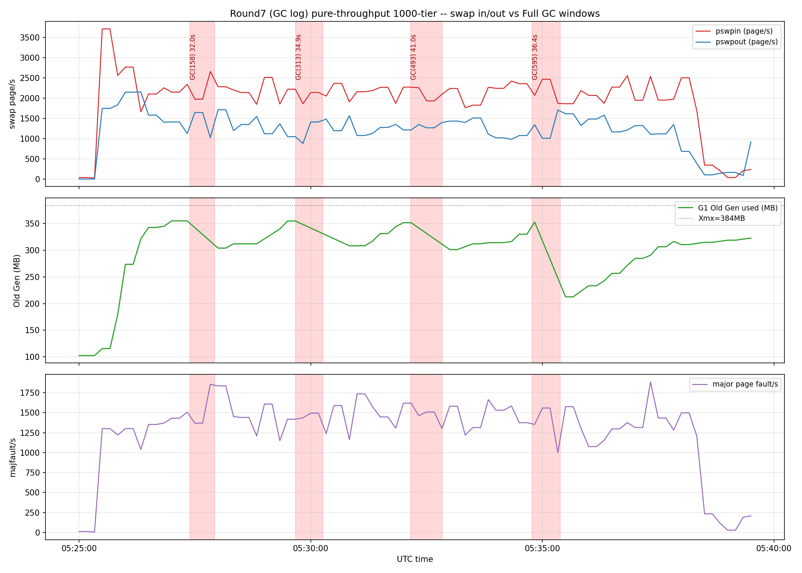

# 7차 부하테스트 — GC 로그 활성화, Full GC ↔ 스왑 메커니즘 직접 증명

**대상 환경:** prod(`api.dbidding.shop`, t4g.micro, vCPU 2개, **RAM 903MB**,
`-Xmx384m -XX:+UseG1GC -XX:+HeapDumpOnOutOfMemoryError -XX:HeapDumpPath=/app/logs/heapdump-%p.hprof
-Xlog:gc*,gc+heap=debug,safepoint:file=/app/logs/gc-%p.log:time,uptime,level,tags:filecount=3,filesize=20M`),
`SPRING_PROFILES_ACTIVE=local-sse,sse-virtual-threads`,
`NOTIFICATION_RECOVERY_NON_URGENT_ENABLED=false`(6차와 동일 설정 유지).

**작성일:** 2026-08-13, 6차 문서
([`8-round6-virtual-threads-findings.md`](8-round6-virtual-threads-findings.md)) 직후 연속 진행.

**배경:** 6차에서 Full GC와 스왑이 같이 움직이는 걸 Prometheus로 확인했지만
"진짜 인과관계"까지는 못 증명했다(old-gen 점유율 상관관계는 있었지만 major
fault는 GC 순간에만 뾰족하게 튀지 않고 넓게 고원처럼 유지됨). 이번엔
**GC 로그(`-Xlog:gc*`)를 직접 켜고 재현**해서, GC의 세부 phase(마킹/포인터
조정/컴팩션 등) 각각이 얼마나 걸리는지 1차 자료로 확보했다.

---

## 1. k6 결과 (pure-throughput 1000-tier)

| 지표 | 값 |
|---|---:|
| 총 요청 | 85,841건(103.65 req/s) |
| http_req_failed | **42.27%**(passes 36,285 / fails 49,556) |
| 실행 시각(UTC) | 2026-08-13T05:25:13 ~ 05:39:01 (13m48s) |

6차의 동일 tier(12.65%)보다 훨씬 나쁘다 — **같은 설정(가상스레드+스케줄러
OFF)인데 실행마다 실패율이 12.65%~42.27%로 크게 흔들린다는 뜻**이다. 아래
GC 로그가 그 이유를 그대로 보여준다: 이번 실행엔 **Full GC가 4번**이나
발생했다(6차는 세션 전체에서 2번뿐이었다).

---

## 2. GC 로그 — Full GC 4회 전체 phase 분해

`docker logs`가 아니라 JVM이 직접 쓴 `/app/logs/gc-1.log`(2.7MB, 20,966줄)를
그대로 분석했다. G1의 Full GC(`Pause Full (G1 Compaction Pause)`)는 5개
phase로 나뉘어 로그에 개별 소요시간이 찍힌다.

| GC | 시각(UTC) | 전체 pause | Phase1 Mark live objects | Phase2 Prepare compaction | Phase3 Adjust pointers | Phase4 Compact heap | Phase5 Reset metadata | 힙(before→after) |
|---|---|---:|---:|---:|---:|---:|---:|---|
| GC(158) | 05:27:23.456~05:27:55.424 | 31,967.8ms | **16,842.7ms(52.7%)** | 1,378.4ms | 7,601.4ms | 3,033.3ms | 1,938.3ms | 383M→300M(384M) |
| GC(313) | 05:29:40.409~05:30:15.309 | 34,900.5ms | **25,758.1ms(73.8%)** | 621.6ms | 6,068.1ms | 2,123.0ms | 265.1ms | 382M→279M(384M) |
| GC(493) | 05:32:09.202~05:32:50.227 | 41,025.0ms | **27,922.9ms(68.1%)** | 1,095.2ms | 8,184.7ms | 2,998.8ms | 656.0ms | 382M→299M(384M) |
| GC(595) | 05:34:46.745~05:35:23.130 | 36,385.6ms | **26,626.5ms(73.2%)** | 484.8ms | 790.1ms | 7,711.2ms | 294.2ms | 382M→192M(384M) |

**핵심 발견 1 — 힙은 매번 383~382M(384M 상한의 99.5%+)에서 터진다.** G1의
Full GC는 old-gen 점유율/할당 실패 기준으로 자체 트리거되는 것이 로그로
직접 확인됐다(6차의 Prometheus 추론을 1차 자료로 재확인).

**핵심 발견 2 — "Phase 1: Mark live objects"가 매번 53~74%를 먹는다.**
384MB 힙을 워커 2개로 마킹하는 건(순수 CPU 연산이면) 1초도 안 걸려야
하는데 17~28초씩 걸린다. 이건 마킹 중 포인터를 따라가다 **스왑아웃된
페이지를 만날 때마다 디스크에서 다시 읽어오는(page fault) 대기 시간**
말고는 설명이 안 된다. Phase3(Adjust pointers, 힙 전체를 다시 훑는 단계)도
같은 이유로 매번 부풀어 있다(0.8~8.2초).

---

## 3. Prometheus 실측 — 스왑/major fault/old-gen을 GC 로그 시각에 정확히 대조

### 3.1 원본 카운터 delta로 확인한 "진짜 발생한 major fault 수"

`node_vmstat_pgmajfault`(커널이 직접 세는 원본 누적 카운터, rate() 계산
전 원본 값 대조 — 추정 아니고 실측):

| 구간 | 시작 카운트 | 끝 카운트 | delta(진짜 발생 건수) | 길이 | 평균(건/s) |
|---|---:|---:|---:|---:|---:|
| GC(158) pause | 22,317,440 | 22,365,787 | **48,347** | 32.0s | 1,511 |
| GC(313) pause | 22,517,427 | 22,579,914 | **62,487** | 34.9s | 1,790 |
| GC(493) pause | 22,736,421 | 22,800,475 | **64,054** | 41.0s | 1,562 |
| GC(595) pause | 22,974,768 | 23,013,120 | **38,352** | 36.4s | 1,054 |
| 테스트 전체(840s) | 22,159,544 | 23,264,757 | 1,105,213 | 840s | 1,316 |

Full GC pause 시간(합 144.3초)에만 **213,240건**의 major fault가 실제로
발생했다. 다만 pause 구간 평균(1,054~1,790/s)이 테스트 전체 평균(1,316/s)
보다 확 튀는 정도는 아니다 — **major fault는 GC 순간에만 특별히 폭증하는
게 아니라 부하가 걸리는 내내 이미 높게 유지되는 상태(고원)이고, GC는 그
상태에서 힙 전체를 훑어야 하니 그 비용을 고스란히 얻어맞는 것**이다.

### 3.2 스왑 "용량"과 "활동"은 다른 것 — 실측으로 구분

같은 테스트 구간 `SwapFree`(용량, gauge)와 `pswpin/pswpout`(활동, 카운터
rate)를 같이 보면:

- SwapFree는 거의 안 움직인다(1,900~2,000MB대에서 거의 고정).
- 그런데 pswpin/pswpout은 초당 1,000~2,500페이지(약 4~10MB/s)씩 계속
  움직인다.

**즉 스왑에 쌓여있는 양(용량)은 안 느는데, 이미 스왑에 나가있는 페이지를
다시 불러오는 일(활동)이 상시로 벌어지고 있다 — thrashing.** 커널이 RAM이
부족해서 뭔가를 계속 내보내는데, 그게 아직 필요한 페이지라서 앱이 곧바로
다시 불러오는 게 반복되는 것이다. "스왑을 얼마나 썼냐"가 아니라 "스왑
활동이 얼마나 자주 일어나냐"가 문제라는 뜻이다.

### 3.3 그래프

(3단 구성: ① pswpin/pswpout, ② G1 Old Gen 사용량(MB, Xmx=384MB 선 표시),
③ major page fault율. 빨간 음영 4개 = 위 §2의 Full GC 실제 pause 구간.
old-gen이 계단식으로 쌓이다 빨간 음영에서 뚝 떨어지는 패턴이 4번 다
보인다.)

---

## 4. 최종 결론 — 결국 RAM이 부족하다

t4g.micro의 물리 RAM은 **903MB**뿐이다. JVM 하나를 띄우는 데 필요한
고정 오버헤드만 계산해도:

| 항목 | 실측/설정값 |
|---|---:|
| `-Xmx384m`(힙 상한) | 384MB |
| Metaspace(GC 로그 실측, `used 147579K committed 150016K`) | ~150MB |
| **JVM 고정 오버헤드 합계** | **~534MB** |
| CodeHeap(3종: non-nmethods/profiled/non-profiled), Compressed Class Space, 스레드 스택, Direct 버퍼(Netty/Tomcat NIO) 등 | 추가 수십~100MB대 |

즉 **JVM 자체 고정 오버헤드만으로 이미 600~700MB대를 먹고, 903MB 중
남는 200MB 안쪽에서 OS 버퍼/캐시 + nginx + docker 오버헤드까지 다
처리해야 하는 구조**다. 그래서 실제 요청 처리(Hibernate 캐시, 커넥션
버퍼, SSE emitter 등)가 조금만 늘어도 즉시 스왑 thrashing이 시작되고,
그 상태에서 Full GC가 힙 전체를 훑으면(§2) 그 thrashing 비용을 그대로
얻어맞아 20~41초씩 멈춘다.

**이건 튜닝으로 해결되는 문제가 아니라 스펙(RAM) 문제다.** 4차/5차
문서의 "384MB 유지, 스펙 문제로 귀결" 결론이 이번 GC 로그/major fault
1차 자료로 더 확실하게 증명됐다.

### 실질적 해법

1. **인스턴스 RAM 증설**(t4g.micro→small/medium 등) — 근본 해결.
2. **JVM in-process 상태 자체를 줄이기** — 힙은 이미 빡빡해서 더 못
   줄임. 대신 Redis 마이그레이션(진행 중), 알림 복구 배치 무제한 로드
   버그 수정(스폰된 별도 작업) 등으로 힙이 짧은 시간에 몰아서 먹는
   패턴 자체를 줄이는 게 실질적 레버다.

---

## 5. 다음 라운드 대비 — RAM 2GB로 늘리면 `-Xmx`는 얼마로 잡아야 하나

**미리 계산해본 추정치**(실측 재검증 전까지는 출발점으로만 쓸 것):

RAM 2048MB에서 시작:

- **JVM 고정 비힙 오버헤드**: 이번 실측 기준 Metaspace 150MB + CodeHeap/
  Compressed Class Space/스레드스택/Direct버퍼 등 추가 수십~100MB대 →
  **약 200~300MB로 추정**(이 부분은 힙 크기와 무관하게 대체로 고정이라
  RAM을 늘려도 크게 안 늘어남 — 로드된 클래스 수, JIT 컴파일량이 원인).
- **OS + nginx + docker 오버헤드**: 이번 세션 기준 대체로 고정, **약
  150~250MB로 추정**.
- 위 둘을 합치면 **약 350~550MB는 힙과 무관하게 필요**.
- 여기에 "이번에 903MB에서 384m+519MB 여유로도 부족했다"는 교훈을
  반영해 **최소 300~400MB의 실질 안전마진**을 추가로 남겨야 한다(단순히
  나머지를 다 힙에 몰아넣으면 같은 thrashing이 더 큰 스케일로 재현될
  위험이 있음).

계산: `2048 - (350~550) - (300~400 안전마진) ≈ 1,100~1,400MB`

**추천 시작값: `-Xmx1280m`(1.25GB) 정도**. 전체 RAM의 약 62%로, 흔히
쓰이는 컨테이너 JVM 힙/한도 비율(50~75%) 안에 들어오면서도, 이번에
"519MB 여유로도 부족했다"는 실측 실패 사례보다는 훨씬 넉넉한 절대
여유(약 700MB 이상)를 남긴다.

**단, 이건 이론적 출발점일 뿐이다.** 실제로 RAM이 늘어나면:
- 동일한 GC 로그(`-Xlog:gc*`) + major fault + old-gen 그래프 방식으로
  재검증해서 Full GC가 실제로 사라지는지, 스왑 thrashing이 실제로
  잦아드는지 확인해야 한다.
- `-Xmx`를 1280m로 고정하고 250/500/1000-tier를 순서대로 돌려보면서
  Full GC 발생 여부로 미세조정하는 게 맞다(더 줄여도 안 죽으면 낮춰서
  OS 여유를 더 주거나, 그래도 Full GC가 나면 좀 더 올리는 식).
- Metaspace/CodeHeap도 필요시 `-XX:MaxMetaspaceSize`, `-XX:ReservedCodeCacheSize`로
  명시적 상한을 걸어두면 예측 가능성이 더 좋아진다(지금은 상한 없이
  자유롭게 커지는 상태).

---

## 6. 한계 및 주의사항

- **같은 설정(6차와 동일)인데 실패율이 12.65%(6차)→42.27%(7차)로 크게
  달랐다** — Full GC 발생 횟수 자체가 테스트마다 들쭉날쭉하다(6차 세션
  전체 2회 vs 7차 이 실행 한 번에 4회). 이 변동성 자체가 "스펙이
  타이트해서 언제 터질지 예측하기 어렵다"는 증거이기도 하다.
- **major fault 지표는 GC 순간에 날카롭게 스파이크치지 않고 넓은 고원
  형태다** — "그 순간 특별히 폭증했다"보다는 "이미 계속 높던 상태에서
  GC가 그 비용을 얻어맞았다"가 더 정확한 표현이다(3.1절).
- **§5의 Xmx 추천값은 검증 전 이론적 추정이다** — 실제 RAM 증설 후
  반드시 재테스트로 확인해야 한다.
- 힙 로그 분석은 4개 Full GC 이벤트뿐이라 통계적으로 표본이 작다 —
  경향성은 뚜렷하지만(모든 이벤트에서 Mark 단계가 53~74%) 절대적인
  비율 수치는 실행마다 다를 수 있다.

## 원본 데이터

- k6 결과: `backend/src/test/k6/results/round7-gclog-pure-throughput-sse1000-20260813.json`
- GC 로그: 서버 `/home/ubuntu/logs/gc-1.log`(2.7MB), 로컬 다운로드본
  `/private/tmp/.../scratchpad/gc-1.log`
- Prometheus range query 원본: `/private/tmp/.../scratchpad/r7_{pswpin,pswpout,oldgen,majfault}.json`
- major fault 원본 카운터 대조: 이 문서 §3.1의 표가 근거 전부(별도 파일 없음, point query 결과 직접 인용)
- 차트 렌더 스크립트: `/private/tmp/.../scratchpad/render_gc_chart.py`
